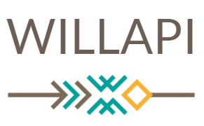

# Willapi

Willapi es una empresa peruana que fabrica polos y casacas para jóvenes mujeres y varones. Willapi es una palabra quechua que significa color anaranjado.

 

## Índice

* [1. Descripción](#1-Descripción)
* [2. Investigación UX](#2-Investigación-UX)
* [3. Objetivos de aprendizaje](#3-Objetivos-de-aprendizaje)

***

## 1. Descipción

La página web que permite validar la tarjeta de crédito pertenece a un sitio web de venta de ropa para jóvenes, la función de las paginas permite realizar la validación de las tarjetas para continuar con la compra online, en una sola página se le solicita el correo electrónico al usuario para registro y posterior envío de su boleta o factura electrónica, luego en la siguiente página se le solicita el número de la tarjeta y el nombre que figura en la tarjeta para realizar la validación.

## 2. Investigación UX:

* `Explicar quiénes son los usuarios y los objetivos en relación con el producto.`
Los usuarios del producto son jóvenes varones y mujeres que les gusta la moda urbana y desean comprar ropa peruana de calidad.

El objetivo del producto es que el usuario pueda validar su tarjeta de crédito para continuar con la compra de los productos.

* `Explicar cómo el producto soluciona los problemas/necesidades de dichos usuarios.`

El producto facilita al usuario verificar su tarjeta porque actualmente los bancos tarjetas de crédito que se entregan a domicilio y a veces sin ningún contrato, entonces, el usuario no tiene la certeza de que esa tarjeta es válida.

* `Luego colocarás la foto de tu primer prototipo en papel.`

Pensé en una propuesta de dos páginas porque es incómodo para el usuario ver muchas páginas, por ello, la primera primera es para que el usuario ingrese solo su correo electrónico y la siguiente página es para realizar la validación de la tarjeta, si la tarjeta es válida puede ir a otra página con un link donde podrá finalizar la compra.

* `Agregar un resumen del feedback recibido indicando las mejoras a realizar.`

Al inicio le mostré mi prototipo a Lulú y me dijo que podría cambiar los colores para que se vea más juvenil y así lo hice, con solo un cambio de colores la página cambió de aspecto. Después, estaba muy complicada porque no podía empezar con el algoritmo de Luhn  y Betsy me dijo dividiera los pasos del algoritmo de Luhn en tareas usando Trello, así lo hice y pude codear el algoritmo. Finalmente tenía dificultad al insertar una imágen al costado de una propiedad innerHTML, entonces Betsy hizo que me diera cuenta que estaba tomando el id de el contenedor global y cualquier elemento que inserte en el contenedor el innerHTML no lo iba a tener en cuenta, por ello, fue necesario crear una etiqueta 
 que tuviera un id para volver a plantear mi código.

* `Imagen del prototipo final.`

La siguiente imagen pertenece al prototipo inicial donde se diseñó el formulario y la interfaz utilizando los colores del imagotipo, para realizar el diseño utilicé    Figma.

## 2. Objetivos de aprendizaje

El objetivo principal de aprendizaje es adquirir experiencia desarrollando
aplicaciones web (WebApp) que interactúen con el usuario a través del navegador
y la lógica, utilizando HTML, CSS y JavaScript como herramientas.

Reflexiona y luego marca los objetivos que has llegado a **entender** y
**aplicar** en tu proyecto.

### UX

* [ ] [Diseñar la aplicación pensando y entendiendo al usuario](https://lms.laboratoria.la/cohorts/lim-2020-01-bc-core-lim012/courses/intro-ux/01-el-proceso-de-diseno/00-el-proceso-de-diseno)
* [ ] [Crear prototipos para obtener feedback e iterar](https://lms.laboratoria.la/cohorts/lim-2020-01-bc-core-lim012/courses/product-design/00-sketching/00-sketching)
* [ ] [Aplicar los principios de diseño visual](https://lms.laboratoria.la/cohorts/lim-2020-01-bc-core-lim012/courses/product-design/01-visual-design/01-visual-design-basics)

### HTML y CSS

* [ ] [Uso correcto de HTML semántico](https://developer.mozilla.org/en-US/docs/Glossary/Semantics#Semantics_in_HTML)
* [ ] [Uso de selectores de CSS](https://developer.mozilla.org/es/docs/Web/CSS/Selectores_CSS)
* [ ] [Construir tu aplicación respetando el diseño realizado](https://lms.laboratoria.la/cohorts/lim-2020-01-bc-core-lim012/courses/css/01-css/02-boxmodel-and-display) (maquetación).

### DOM

* [ ] [Uso de selectores de nodos del DOM](https://lms.laboratoria.la/cohorts/lim-2020-01-bc-core-lim012/courses/browser/02-dom/03-1-dom-methods-selection)
* [ ] [Manejo de eventos del DOM](https://lms.laboratoria.la/cohorts/lim-2020-01-bc-core-lim012/courses/browser/02-dom/04-events)
* [ ] [Manipulación dinámica del DOM](https://developer.mozilla.org/es/docs/Referencia_DOM_de_Gecko/Introducci%C3%B3n)

### Javascript

* [ ] [Manipulación de strings](https://lms.laboratoria.la/cohorts/lim-2020-01-bc-core-lim012/courses/javascript/06-strings/01-strings)
* [ ] [Uso de condicionales](https://lms.laboratoria.la/cohorts/lim-2020-01-bc-core-lim012/courses/javascript/02-flow-control/01-conditionals-and-loops)
* [ ] [Uso de bucles](https://lms.laboratoria.la/cohorts/lim-2020-01-bc-core-lim012/courses/javascript/02-flow-control/02-loops)
* [ ] [Uso de funciones](https://lms.laboratoria.la/cohorts/lim-2019-09-bc-core-lim011/courses/javascript/02-flow-control/03-functions)
* [ ] [Datos atómicos y estructurados](https://www.todojs.com/tipos-datos-javascript-es6/)
* [ ] Utilizar ES Modules (`import` | `export`).

### Testing

* [ ] [Testeo de tus funciones](https://jestjs.io/docs/es-ES/getting-started)

### Git y GitHub

* [ ] [Comandos de git](https://lms.laboratoria.la/cohorts/lim-2019-09-bc-core-lim011/courses/scm/01-git/04-commands)
  (`add` | `commit` | `pull` | `status` | `push`).
* [ ] [Manejo de repositorios de GitHub](https://lms.laboratoria.la/cohorts/lim-2019-09-bc-core-lim011/courses/scm/02-github/01-github)  (`clone` | `fork` | `gh-pages`).

### Buenas prácticas de desarrollo

* [ ] Organizar y dividir el código en módulos (Modularización).
* [ ] Uso de identificadores descriptivos (Nomenclatura | Semántica).
* [ ] Uso de linter para seguir buenas prácticas (ESLINT).
